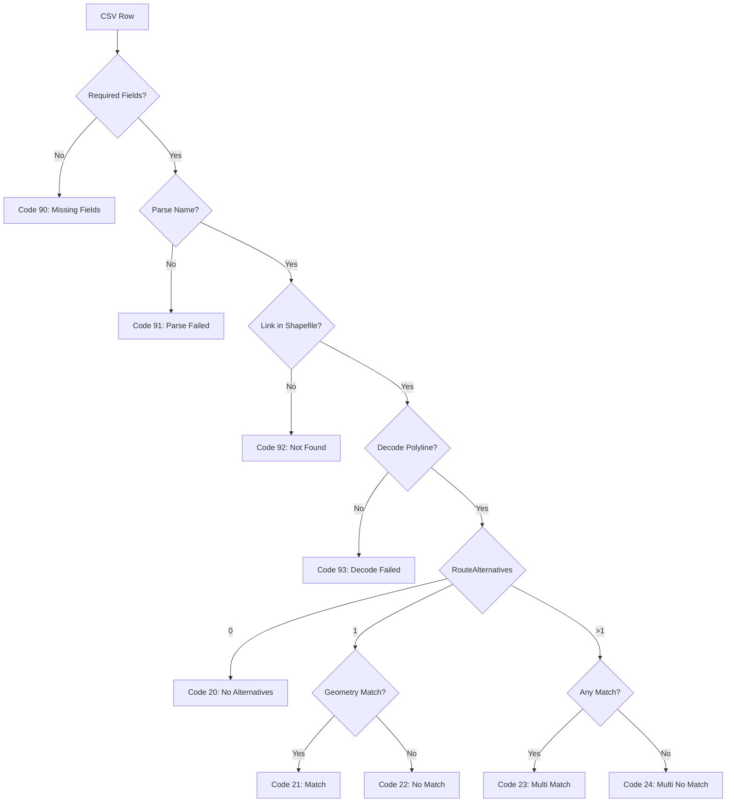

# Data Model: Dataset Control and Reporting

## Core Entities

### 1. ValidationParameters
Configuration object for validation thresholds and modes.

```python
@dataclass
class ValidationParameters:
    hausdorff_threshold_m: float = 5.0
    length_check_mode: str = "ratio"  # "off", "ratio", "exact"
    length_ratio_min: float = 0.90
    length_ratio_max: float = 1.10
    epsilon_length_m: float = 0.5
    coverage_min: float = 0.85
    coverage_spacing_m: float = 1.0
    min_link_length_m: float = 20.0
    crs_metric: str = "EPSG:2039"
    polyline_precision: int = 5
```

### 2. ValidationRow
Single observation with validation result.

```python
@dataclass
class ValidationRow:
    # Input fields
    data_id: str
    name: str  # Link identifier (s_from-to)
    route_alternative: int
    timestamp: datetime
    polyline: str  # Encoded polyline

    # Parsed fields
    from_id: Optional[str]
    to_id: Optional[str]
    decoded_geometry: Optional[LineString]

    # Validation results
    is_valid: bool
    valid_code: int

    # Diagnostic data
    hausdorff_distance: Optional[float]
    length_ratio: Optional[float]
    coverage: Optional[float]
    matched_alternative_index: Optional[int]
```

### 3. ValidCode (Enumeration)
Hierarchical validation codes with clear semantics.

```python
class ValidCode(IntEnum):
    # Geometry match codes (0-4)
    EXACT_MATCH = 0
    WITHIN_TOLERANCE = 1
    DISTANCE_FAILURE = 2
    LENGTH_FAILURE = 3
    COVERAGE_FAILURE = 4

    # Route alternative codes (20-24)
    ZERO_ALTERNATIVES_FAIL = 20
    ONE_ALTERNATIVE_MATCH = 21
    ONE_ALTERNATIVE_FAIL = 22
    MULTI_ALTERNATIVES_MATCH = 23
    MULTI_ALTERNATIVES_FAIL = 24

    # Data availability codes (90-93)
    REQUIRED_FIELDS_MISSING = 90
    NAME_PARSE_FAILURE = 91
    LINK_NOT_IN_SHAPEFILE = 92
    POLYLINE_DECODE_FAILURE = 93
```

### 4. LinkReport
Aggregated validation statistics per shapefile link.

```python
@dataclass
class LinkReport:
    # Link identification
    link_id: str  # From shapefile
    from_id: str
    to_id: str

    # Observation counts
    total_observations: int
    valid_observations: int
    invalid_observations: int

    # RouteAlternative analysis
    single_alternative_count: int
    multi_alternative_count: int

    # Result classification
    result_code: int
    result_label: str
    num: Optional[float]  # Percentage or null

    # Period metadata
    start_date: Optional[date]
    end_date: Optional[date]
```

### 5. ResultCode (Enumeration)
Report-level result codes for link classification.

```python
class ResultCode(IntEnum):
    ALL_VALID = 0  # 100% valid
    SINGLE_ALT_PARTIAL = 1  # Single alternative, some invalid
    SINGLE_ALT_ALL_INVALID = 2  # Single alternative, 0% valid
    MULTI_ALT_ALL_VALID = 30  # Multiple alternatives, 100% valid
    MULTI_ALT_PARTIAL = 31  # Multiple alternatives, mixed
    MULTI_ALT_ALL_INVALID = 32  # Multiple alternatives, 0% valid
    NOT_RECORDED = 41  # No observations for link
    PARTIALLY_RECORDED = 42  # Some time periods missing
```

## Data Relationships

### CSV → ValidationRow
```
CSV Row → Parse Name → Extract from_id/to_id
        → Decode Polyline → Create LineString
        → Apply validation → Set is_valid, valid_code
```

### ValidationRow → LinkReport
```
Multiple ValidationRows (same link)
    → Group by link_id
    → Count valid/invalid
    → Analyze RouteAlternatives
    → Calculate percentage
    → Assign result_code
```

### Shapefile Integration
```
Reference Shapefile
    ├── Provides: Id, From, To, geometry
    ├── Used for: Join validation
    └── Output: Added fields (result_code, result_label, num)
```

## Validation Flow



## Aggregation Rules

### Deduplication
Before aggregation, remove duplicates by:
- link_id + timestamp + polyline

### Percentage Calculation
For result codes 1 and 31:
```python
num = (valid_observations / total_observations) * 100
```

### Special Cases
- Result code 41: num = None (null)
- Result code 42: num = percentage of covered time periods

## State Transitions

### Observation States
```
Raw → Parsed → Validated → Aggregated
```

### Link Report States
```
No Data → Partial Data → Complete Data
         ↓              ↓
    Code 41        Code 0-32,42
```

## Constraints

### Data Integrity
- from_id and to_id must be strings (preserve leading zeros)
- valid_code must follow hierarchical evaluation order
- is_valid must be consistent with valid_code

### Performance
- Decode polylines once and cache
- Build spatial index for shapefile once
- Process in chunks for memory efficiency

### Business Rules
- First failure in hierarchy determines valid_code
- Any matching alternative makes observation valid
- Coverage calculated on densified geometries
- Length ratios stabilized for short links